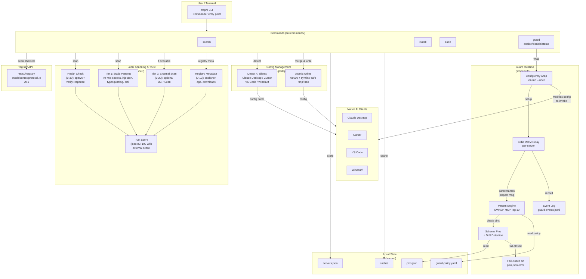

<p align="center">
  <picture>
    <source media="(prefers-color-scheme: dark)" srcset="./assets/banner-dark.svg">
    <source media="(prefers-color-scheme: light)" srcset="./assets/banner-light.svg">
    
  </picture>
</p>

# mcpm

**The MCP package manager that guards your AI's tools at runtime -- search, install, audit, and inspect every MCP server from your terminal.**

[](https://www.npmjs.com/package/@getmcpm/cli)
[](./LICENSE)
[](https://github.com/getmcpm/cli/actions)
[](https://snyk.io/advisor/npm-package/@getmcpm/cli)

---

The risky part of an MCP server doesn't show up at install -- it shows up while your agent is running: prompt injection hidden in a tool's output, a server that quietly rewrites its tools after you approved them, a sampling request that smuggles instructions into your model. mcpm scores every install for hardcoded secrets, prompt injection, and typosquatting ([66% of MCP servers have security findings](https://agentseal.org/blog/mcp-server-security-findings)) -- then runs a live guard between your AI client and each server, pinning tool definitions against rug-pulls and blocking injection before it reaches the model.

<p align="center">
  
</p>

## Quick start

```bash
npm install -g @getmcpm/cli

mcpm search filesystem
mcpm info io.github.domdomegg/filesystem-mcp
mcpm install io.github.domdomegg/filesystem-mcp
```

## Features

### Search the MCP registry

Query the official MCP Registry and see results with trust indicators.

```
$ mcpm search filesystem

  Name                                              Description                    Score
  io.github.domdomegg/filesystem-mcp                 File system access via MCP     82/100
  io.github.Digital-Defiance/mcp-filesystem           Read-only filesystem server    67/100
  ...
```

### Install with trust assessment

Every install runs a metadata-based trust assessment before writing config.

```
$ mcpm install io.github.domdomegg/filesystem-mcp

  Trust Score: 82/100 (safe)
    Health check:    30/30
    Static scan:     32/40
    External scan:    —  (install mcp-scan for full coverage)
    Registry meta:   10/10

  Install to Claude Desktop? (Y/n)
```

### Audit installed servers

Scan everything you have installed. Get a trust report.

```
$ mcpm audit

  Server                                   Client          Score   Level
  servers-filesystem                        Claude Desktop  82/100  safe
  servers-github                            Cursor          74/100  caution
  some-sketchy-server                       VS Code         31/100  risky
```

### Cross-IDE support

One tool for all your AI clients. mcpm reads and writes the correct config format for each.

```
$ mcpm list

  Client            Server Name                  Status     Command/URL
  Claude Desktop    servers-filesystem           active     npx -y servers-filesystem
  Claude Desktop    servers-github               active     npx -y servers-github
  Cursor            servers-fetch                disabled   npx -y servers-fetch
```

### Doctor: check your MCP setup health

Find misconfigurations, missing runtimes, and broken servers.

```
$ mcpm doctor

  Checking MCP setup...
  [pass] Claude Desktop config found
  [pass] npx runtime available
  [warn] Cursor config not found
  [pass] 3 servers installed, 0 with errors
```

### Stack files: docker-compose for MCP

Declare your project's MCP servers in `mcpm.yaml`, lock versions with trust snapshots, and let every team member replicate the setup with one command.

```bash
mcpm export > mcpm.yaml          # dump current setup
mcpm lock                        # resolve versions + trust snapshot
mcpm up                          # install everything from mcpm.yaml
mcpm diff                        # compare installed vs declared state
```

Stack files include a trust policy. If a server's trust score drops below the threshold, `mcpm up` blocks it.

```yaml
version: "1"
policy:
  minTrustScore: 60
  blockOnScoreDrop: true
servers:
  io.github.domdomegg/filesystem-mcp:
    version: "^1.0.0"
  io.github.modelcontextprotocol/servers-github:
    version: "1.2.3"
    env:
      GITHUB_TOKEN: { required: true, secret: true }
```

### Scaffold a stack file

Start a new project's MCP setup in one command. `mcpm init` writes a starter `mcpm.yaml` you fill in with servers from `mcpm search`.

```
$ mcpm init

  Created mcpm.yaml.

  Next steps:
    mcpm search <query>   find MCP servers in the registry
    edit mcpm.yaml        add them under `servers:`
    mcpm lock             resolve and lock versions
    mcpm up               install from the stack file
```

It refuses to clobber an existing `mcpm.yaml` (pass `--force` to overwrite). mcpm deliberately doesn't ship curated packs — blessing specific community servers is a trust decision a security tool shouldn't bake in.

## Trust score

The trust score is a 0-100 assessment based on publicly available metadata. It is **not** a source code audit.

What it checks:

| Component | Points | What it measures |
|---|---|---|
| Health check | 0-30 | Can the server start and respond to `list_tools`? |
| Static scan | 0-40 | Regex-based detection of hardcoded secrets, prompt injection patterns in tool descriptions, typosquatting in package names, suspicious argument schemas |
| External scanner | 0-20 | Results from [MCP-Scan](https://github.com/invariantlabs-ai/mcp-scan) if installed (optional) |
| Registry metadata | 0-10 | Verified publisher, publish date, download count (capped to 0 when critical findings present) |

Levels: **safe** (80+), **caution** (50-79), **risky** (below 50).

Without an external scanner installed, the maximum possible score is 80/100. The static scan catches common patterns but cannot detect all vulnerabilities. Treat the score as a signal, not a guarantee.

## Commands

| Command | Description |
|---|---|
| `mcpm search <query>` | Search the MCP registry for servers |
| `mcpm install <name>` | Install an MCP server from the registry |
| `mcpm info <name>` | Show full details for an MCP server |
| `mcpm list` | List all installed MCP servers across detected AI clients |
| `mcpm remove <name>` | Remove an MCP server from client config(s) |
| `mcpm audit` | Scan all installed servers and produce a trust report |
| `mcpm update` | Check for newer versions and update installed servers |
| `mcpm outdated` | Show version drift and trust regression for installed servers |
| `mcpm secrets` | Manage MCP server credentials (AES-GCM encrypted at rest; key held in the OS keychain — macOS Keychain / libsecret / Windows DPAPI — so a copied store can't be decrypted off-machine, with a machine-derived-key fallback where no keychain is available). `mcpm secrets migrate` upgrades older entries |
| `mcpm publish scaffold` | Create a .mcpm-publish.yaml manifest interactively |
| `mcpm publish check` | Dry-run: show trust score and what would be submitted |
| `mcpm publish` | Submit to the official MCP registry (requires GITHUB_TOKEN) |
| `mcpm doctor` | Check MCP setup health and report issues |
| `mcpm init` | Scaffold a starter `mcpm.yaml` stack file in the current directory |
| `mcpm disable <name>` | Disable an MCP server without removing it from config |
| `mcpm enable <name>` | Re-enable a previously disabled MCP server |
| `mcpm import` | Import existing MCP servers from client config files |
| `mcpm alias` | Create short aliases for long MCP server names |
| `mcpm export` | Export installed servers as an mcpm.yaml stack file |
| `mcpm lock` | Resolve versions and create mcpm-lock.yaml with trust snapshots |
| `mcpm up` | Install all servers from mcpm.yaml with trust verification |
| `mcpm diff` | Compare installed servers against mcpm.yaml and lock file |
| `mcpm completions <shell>` | Generate shell completion scripts (bash, zsh, fish) |
| `mcpm why <name>` | Explain a server's trust score (breakdown of all components) |
| `mcpm serve` | Start mcpm as an MCP server (stdio transport) |
| `mcpm guard enable` | Wrap detected client configs with the inspection relay |
| `mcpm guard disable` | Restore original client configs |
| `mcpm guard status` | Show what's wrapped and the per-server pin state |
| `mcpm guard demo` | Run the synthetic prompt-injection scenario (visible block) |
| `mcpm guard accept-drift <server>` | Re-pin a tool's schema after a legitimate upgrade |
| `mcpm guard mute <signature-id>` | Disable a signature with optional `--for <duration>` |
| `mcpm guard unmute <signature-id>` | Re-enable a muted signature |
| `mcpm guard pause` | Pause all guard inspection (debugging escape hatch) |
| `mcpm guard cleanup` | Prune pin entries for uninstalled servers |
| `mcpm guard list-signatures` | Show the shipped OWASP MCP Top 10 signature catalog |
| `mcpm guard reset-integrity` | Regenerate the pins.json or guard-policy.yaml integrity sidecar |

Run `mcpm <command> --help` for options and flags.

## Runtime defense (mcpm-guard)

Install-time trust scoring catches most poisoned servers before they ship. But what about **rug-pulls** — a server that changes its tool definitions after you've already approved them? Or **prompt-injection in tool responses** — adversarial text embedded in a Slack message, web page, or calendar invite that the agent reads through your trusted MCP server?

`mcpm guard` adds a runtime inspection layer. It wraps every installed MCP server with a stdio relay, scans tool descriptions / responses / arguments for OWASP MCP Top 10 attack patterns, pins each tool's schema at install time, and blocks calls when the live response drifts from the pin (rug-pull defense).

### What happens on every tool call

The guard sits inline on the stdio channel between your AI client and each MCP server, so it sees **both halves of every tool call** and inspects them as they pass:

- **The request your agent sends** — the tool name and arguments, checked for sensitive-path exfil and injection smuggled into call parameters.
- **The response the server returns** — checked for instruction injection hidden in the tool's output (the Slack message, web page, or calendar invite your agent is about to read).
- **The tool's own definition** — `tools/list` descriptions, schemas, and annotations, checked against the schema pinned at approval time, so a server can't quietly rewrite a tool you already trusted.

When a frame trips a signature, drift check, or policy rule, the guard **drops it and hands your agent a JSON-RPC error in its place** — carrying the signature id and a `remediation` string — so the poisoned content never reaches your model. Clean calls pass straight through (p99 ~0.065 ms on small frames). Server-initiated `sampling` / `elicitation` requests are inspected the same way, with the error routed back to the server rather than to your agent.

### Quick start

```bash
npm install -g @getmcpm/cli@latest

mcpm guard enable           # wrap detected client configs (Claude Desktop / Claude Code / Cursor / VS Code / Windsurf)
# → restart your IDE so it re-spawns the wrapped server processes
mcpm guard demo             # synthetic prompt-injection scenario — see a live block in your terminal
mcpm guard status           # what's protected, what's still in first-session-pin mode
```

The `demo` command boots an in-process synthetic malicious server that returns a canned prompt-injection payload; the relay blocks it. Total time from `npm install` to a screenshot-worthy block: ~5 minutes (most of which is the IDE restart).

### What it catches

| Category | Attack class | Action |
|---|---|---|
| OWASP-MCP-1 | Tool-description injection (poisoning) | block |
| OWASP-MCP-1 | Schema / annotation drift since install (rug-pull) | block |
| OWASP-MCP-1 | Description-only drift (cosmetic tier) | warn |
| OWASP-MCP-1 | Injection in `initialize` instructions | block |
| OWASP-MCP-2 | Instruction injection in tool responses | block |
| OWASP-MCP-2 | Instruction injection in resource / prompt content | warn (forward) |
| OWASP-MCP-7 | Sensitive-path exfil in tool arguments | warn (promote to block via policy) |
| Hidden chars | Zero-width / bidi / non-printable in tool metadata | high (warn) |
| Sampling | Injection in a server-initiated `sampling` prompt | block (to the server) |

Detection is regex + structural; NFKC + zero-width-char stripping defeats the common Unicode evasions, and a separate hidden-character *presence* check flags evasion carriers before they're normalized away. See `mcpm guard list-signatures` for the current shipped set.

### Confinement (opt-in enforcement)

Everything above is *detection* — the relay reasons about the JSON-RPC bytes and warns or blocks. But a server that decides to read `~/.ssh` or write a `~/Library/LaunchAgents` persistence hook never expresses that through inspectable traffic. `mcpm guard enable --confine` complements detection with *enforcement*: it wraps each relayed stdio server in an OS sandbox that physically denies reads of a secret-file denylist and writes outside caches/scratch, so the server can't exfil credentials or persist regardless of the JSON-RPC it emits. `mcpm guard doctor-confine` reports backend availability and which servers are enrolled. **macOS only** for now (Seatbelt/`sandbox-exec`); on other platforms it warns and runs unconfined rather than giving a false sense of protection. See `docs/GUARD.md` for the tier details and caveats.

### Day-1 commands

```bash
mcpm guard enable [--client <name>] [--server <name>] [--dry-run]    # wrap detected configs
mcpm guard disable [--client <name>] [--server <name>]               # unwrap
mcpm guard status                                                    # what's wrapped + pin state
mcpm guard demo                                                      # synthetic attack-block demo
mcpm guard list-signatures [--json]                                  # show shipped signatures
mcpm guard enable --confine                                          # also OS-sandbox wrapped stdio servers (macOS)
mcpm guard doctor-confine [--json]                                   # confine backend availability + enrolled servers
```

### When a block fires

The relay returns a JSON-RPC error response to your IDE with the signature id + a `remediation` string telling you exactly which command to run. Two typical cases:

```bash
# False positive on a legitimate signature
mcpm guard mute owasp-mcp-2-instruction-injection-in-response --for 5m

# Schema drift on a legitimate server upgrade
mcpm guard accept-drift slack-mcp --tool send_message --new-hash sha256:abc... --yes
```

### Audit the log

Every block / warn is appended to `~/.mcpm/guard-events.jsonl`. Inspect with `jq`:

```bash
# Last hour's blocks
tail -n 1000 ~/.mcpm/guard-events.jsonl | jq 'select(.action == "block")'

# Group by signature id
jq -s 'group_by(.findings[0].signature_id) | map({sig: .[0].findings[0].signature_id, n: length})' \
   < ~/.mcpm/guard-events.jsonl

# Top-N most-blocked servers
jq -s 'group_by(.server_name) | map({server: .[0].server_name, n: length}) | sort_by(-.n) | .[:10]' \
   < ~/.mcpm/guard-events.jsonl
```

### When you're debugging and need to turn it off briefly

```bash
mcpm guard pause --for 10m     # disables all inspection for 10 minutes
mcpm guard pause --off         # cancel an active pause
```

### Read more

- `docs/GUARD.md` — full command reference
- `docs/SIGNATURES.md` — signature catalog + how to contribute new ones
- `docs/POLICY.md` — `~/.mcpm/guard-policy.yaml` reference

## Agent mode

mcpm can run as an MCP server itself, letting AI agents search, install, and audit MCP servers programmatically.

```json
{
  "mcpServers": {
    "mcpm": {
      "command": "npx",
      "args": ["-y", "@getmcpm/cli", "serve"]
    }
  }
}
```

This exposes 9 tools: `mcpm_search`, `mcpm_install`, `mcpm_info`, `mcpm_list`, `mcpm_remove`, `mcpm_audit`, `mcpm_doctor`, `mcpm_setup`, and `mcpm_up`.

The `mcpm_setup` tool takes a natural language description like "filesystem and GitHub" and handles everything: search, trust scoring, install. One tool call to assemble a working MCP toolchain.

**Try it** -- add the config above to your MCP client, restart, then ask your agent:

> You have mcpm tools available (from @getmcpm/cli, the MCP package manager, not the Minecraft one). Use them to find MCP servers for filesystem access and GitHub. Check their trust scores and install anything above 60.

## Supported clients

| Client | Config path (macOS) |
|---|---|
| Claude Desktop | `~/Library/Application Support/Claude/claude_desktop_config.json` |
| Claude Code | `~/.claude.json` (user-global `mcpServers`) |
| Cursor | `~/.cursor/mcp.json` |
| VS Code | `~/Library/Application Support/Code/User/mcp.json` |
| Windsurf | `~/.codeium/windsurf/mcp_config.json` |

Linux and Windows paths are also supported. See `mcpm doctor` to verify which clients are detected on your system.

## How it works

mcpm is a local-first CLI. There is no mcpm backend or account system.



1. **Search and install** query the [official MCP Registry API](https://registry.modelcontextprotocol.io) (v0.1) maintained by the Model Context Protocol project.
2. **Trust assessment** runs locally using built-in scanners (regex-based pattern detection) and optionally wraps [MCP-Scan](https://github.com/invariantlabs-ai/mcp-scan) for deeper analysis.
3. **Config management** reads and writes the native config file for each AI client. All writes use atomic file operations with restricted permissions (0o600 files, 0o700 directories).
4. **Local state** lives in `~/.mcpm/` (installed server registry, scan results, response cache).

No telemetry. No analytics. No account required.

## Contributing

Contributions are welcome.

```bash
git clone https://github.com/getmcpm/cli.git
cd cli
pnpm install
pnpm test
pnpm build
```

Before submitting a PR:

- Run `pnpm test` and ensure all tests pass
- Run `pnpm lint` to check types
- Keep commits focused -- one change per commit
- Follow [conventional commit](https://www.conventionalcommits.org/) format

This project is MIT licensed. See [LICENSE](./LICENSE).

## Security

If you discover a security vulnerability, please use [GitHub's private vulnerability reporting](https://github.com/getmcpm/cli/security/advisories/new) instead of opening a public issue. We will respond within 48 hours.

For trust assessment issues (false positives/negatives in the scanner), regular GitHub issues are fine.

## License

[MIT](./LICENSE)
