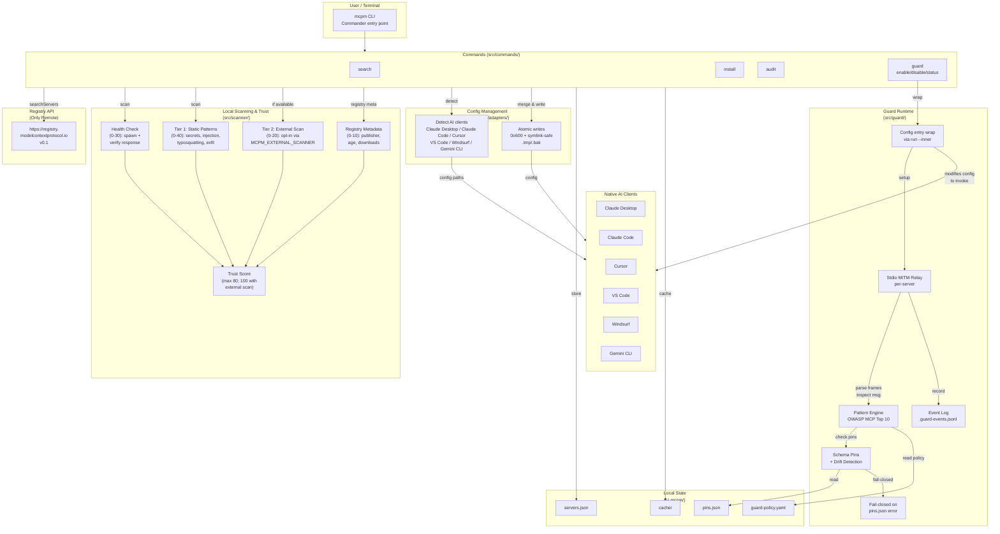

<p align="center">
  <picture>
    <source media="(prefers-color-scheme: dark)" srcset="./assets/banner-dark.svg">
    <source media="(prefers-color-scheme: light)" srcset="./assets/banner-light.svg">
    
  </picture>
</p>

# mcpm

**A runtime security guard for your AI's tools -- and the package manager to install them.** Blocks prompt injection, tool poisoning, and credential exfiltration in live MCP traffic. Local-first, deterministic, no LLM in the enforcement path.

[](https://www.npmjs.com/package/@getmcpm/cli)
[](./LICENSE)
[](https://github.com/getmcpm/cli/actions)
[](https://snyk.io/advisor/npm-package/@getmcpm/cli)

---

The risky part of an MCP server doesn't show up at install -- it shows up while your agent is running: prompt injection hidden in a tool's output, a server that quietly rewrites its tools after you approved them, a sampling request that smuggles instructions into your model. Being listed in a registry is not a safety signal -- in 2026 a proof-of-concept poisoned server was [accepted by 9 of 11 public registries and marketplaces](https://www.ox.security/blog/mcp-supply-chain-advisory-rce-vulnerabilities-across-the-ai-ecosystem/). So mcpm scores every install for hardcoded secrets, prompt injection, and typosquatting -- then runs a live guard between your AI client and each server, pinning tool definitions against rug-pulls and blocking injection before it reaches the model.

**You don't have to take our word for any of that.** Guards are easy to claim and hard to check, so the measuring stick is public: [**mcp-guardbench**](https://github.com/getmcpm/mcp-guardbench) is a guard-agnostic benchmark -- versioned attack and benign cases, an open schema, and a runner that scores *any* MCP guard through its own published CLI. mcpm is scored the same way as everyone else, by shelling out to `mcpm guard inspect`, never by importing its own engine.

mcpm currently scores 100% recall at a 0% false-positive rate on that corpus -- which is **by construction**, since the corpus was extracted from mcpm's own test fixtures. That is a baseline, not a boast. It gets interesting when someone scores a second guard, or contributes a case mcpm misses.

<p align="center">
  
</p>

## Quick start

Install with the package manager you already use:

| Method | Command |
|---|---|
| **npm** (global) | `npm install -g @getmcpm/cli` |
| **npx** (no install) | `npx @getmcpm/cli <command>` |
| **pnpm** | `pnpm add -g @getmcpm/cli` |
| **mise** | `mise use -g npm:@getmcpm/cli` |

**Requires Node `^22.22.2 || ^24.15.0 || >=26.0.0`** — that is **22.22.2+, 24.15.0+ or
26+**, the intersection of what every runtime dependency itself supports. Everything
else is excluded, 23.x and 25.x included. npm warns `EBADENGINE` and fails outright
under `--engine-strict`; pnpm installs silently and exits 0 unless you set
`engine-strict=true`, so there an unsupported Node surfaces as a runtime error rather
than an install one.

The binary is `mcpm`. **Heads up:** the `mcpm` Homebrew formula is a *different,
unrelated* project ([mcpm.sh](https://mcpm.sh)) — install this mcpm via
npm/npx/pnpm/mise above (all resolve the scoped `@getmcpm/cli` package, so there's
no name collision). A dedicated Homebrew tap is deferred; see
[`docs/DISTRIBUTION.md`](docs/DISTRIBUTION.md).

```bash
mcpm search filesystem
mcpm info io.github.domdomegg/filesystem-mcp
mcpm install io.github.domdomegg/filesystem-mcp
```

## Features

### Search the MCP registry

Query the official MCP Registry and see results with trust indicators.

```
$ mcpm search filesystem

  Name                                    Description                   Version  Transport  Status
  io.github.domdomegg/filesystem-mcp       File system access via MCP    1.4.0    stdio      active
  io.github.Digital-Defiance/mcp-filesystem Read-only filesystem server  0.9.2    stdio      active
  ...
```

Search shows registry lifecycle status, not a trust score -- it is a fast discovery list and does not run the scanner per result. Computed trust lives in `mcpm why`, `info`, `install`, and `audit`.

### Install with trust assessment

Every install runs a metadata-based trust assessment before writing config.

```
$ mcpm install io.github.domdomegg/filesystem-mcp

  ███████████████░░░░░ 57/80 CAUTION
    ├─ Health check: not yet run
    ├─ Tool descriptions: score 32/40
    ├─ Package: publisher verification passed
    └─ External scan: not available (set MCPM_EXTERNAL_SCANNER for deeper analysis)

  Install to Claude Desktop? (Y/n)
```

### Audit installed servers

Scan everything you have installed. Get a trust report.

```
$ mcpm audit

  Server                                   Score  Level    Findings
  servers-filesystem                        72/80  safe     0
  servers-github                            52/80  caution  2
  some-sketchy-server                       24/80  risky    5
```

### Cross-IDE support

One tool for all your AI clients. mcpm reads and writes the correct config format for each.

```
$ mcpm list

  Client            Server Name                  Status     Command/URL
  Claude Desktop    servers-filesystem           active     npx -y servers-filesystem
  Claude Desktop    servers-github               active     npx -y servers-github
  Cursor            servers-fetch                disabled   npx -y servers-fetch
```

### Doctor: check your MCP setup health

Find misconfigurations, missing runtimes, broken servers, and plaintext secrets pasted into client config.

```
$ mcpm doctor

  Checking MCP setup...
  [pass] Claude Desktop config found
  [pass] npx runtime available
  [warn] Cursor config not found
  [pass] 3 servers installed, 0 with errors
  [warn] plaintext secret (advisory): github-mcp · env 'GITHUB_TOKEN' — GitHub token
         Move it to the encrypted store: mcpm secrets set <server> <KEY>
```

The plaintext-secret scan reports the key name and label only — never the value — and skips values already stored as `mcpm:keychain:` placeholders. It's advisory (never fails `doctor`).

### Stack files: docker-compose for MCP

Declare your project's MCP servers in `mcpm.yaml`, lock versions with trust snapshots, and let every team member replicate the setup with one command.

```bash
mcpm export > mcpm.yaml          # dump current setup
mcpm lock                        # resolve versions + trust snapshot
mcpm up                          # install everything from mcpm.yaml
mcpm diff                        # compare installed vs declared state
```

Stack files include a trust policy. If a server's trust score drops below the threshold, `mcpm up` blocks it.

```yaml
version: "1"
policy:
  minTrustScore: 60
  blockOnScoreDrop: true
servers:
  io.github.domdomegg/filesystem-mcp:
    version: "^1.0.0"
  io.github.modelcontextprotocol/servers-github:
    version: "1.2.3"
    env:
      GITHUB_TOKEN: { required: true, secret: true }
```

### Scaffold a stack file

Start a new project's MCP setup in one command. `mcpm init` writes a starter `mcpm.yaml` you fill in with servers from `mcpm search`.

```
$ mcpm init

  Created mcpm.yaml.

  Next steps:
    mcpm search <query>   find MCP servers in the registry
    edit mcpm.yaml        add them under `servers:`
    mcpm lock             resolve and lock versions
    mcpm up               install from the stack file
```

It refuses to clobber an existing `mcpm.yaml` (pass `--force` to overwrite). mcpm deliberately doesn't ship curated packs — blessing specific community servers is a trust decision a security tool shouldn't bake in.

## Trust score

The trust score is a 0-100 assessment based on publicly available metadata. It is **not** a source code audit.

What it checks:

| Component | Points | What it measures |
|---|---|---|
| Health check | 0-30 | Can the server start and respond to `list_tools`? |
| Static scan | 0-40 | Regex-based detection of hardcoded secrets, prompt injection patterns in tool descriptions, typosquatting in package names, suspicious argument schemas |
| External scanner | 0-20 | Results from a third-party scanner you have installed, opt-in via `MCPM_EXTERNAL_SCANNER` (off by default) |
| Registry metadata | 0-10 | Verified publisher, publish date, download count (capped to 0 when critical findings present) |

Levels are a **ratio** of the points available, not absolute: **safe** at 80% of `maxPossible` or better, **caution** at 50-79%, **risky** below 50%. With no external scanner (`maxPossible` 80) that puts safe at 64 points, not 80.

`mcpm audit` shows **`clean · not run`** where the server cleared every check that actually ran and the only unmeasured component is the health check — audit never executes servers, so that bucket scores a flat 15/30 and would otherwise drag every flawless server into **caution**. It is a statement about what mcpm did (found nothing, ran nothing), deliberately weaker than **safe**, which is reserved for servers whose health check really ran.

Without an external scanner, the maximum possible score is 80/100 and the bucket is dropped from the total rather than counted as a failure. The static scan catches common patterns but cannot detect all vulnerabilities. Treat the score as a signal, not a guarantee.

**External scanning is opt-in and mcpm never downloads a scanner.** Set `MCPM_EXTERNAL_SCANNER` to the path or name of a scanner you have already installed. mcpm probes it with `<scanner> --version` and, if that exits 0, scans each server with `<scanner> --json <server-name>`, expecting `{"findings": [...]}` on stdout. A scanner whose output cannot be read is treated as **absent** rather than as a clean pass, so the bucket leaves the total instead of silently earning 20/20 — otherwise any binary that exits 0 would raise trust scores.

Package runners (`npx`, `uvx`, `pipx`, `docker`, shells, …) are refused, including via symlink or a runner's `-cli.js` entrypoint. Be clear about what that is worth: it is a **footgun guard**, not a security boundary. Anyone who can set this variable can usually set `PATH` or drop a file too. What it buys is that a pasted `npx …` recipe — or a future mcpm default drifting back toward one — cannot quietly re-create the fetch-and-execute vector this seam was rebuilt to remove.

Those 20 points **inform the score but cannot clear a safety floor.** The MCP server surface (`mcpm_install`, `mcpm_up`) enforces a hard trust floor of 25 that no caller-supplied value may lower — and since `MCPM_EXTERNAL_SCANNER` names an arbitrary executable, a two-line script printing `{"findings": []}` is caller-supplied input too. So the floor is compared against mcpm's own evidence only: health check + static scan + registry metadata, out of 80. The exclusion is one-directional — a scanner reporting a critical finding still drags a server *down* through the floor (via the registry-metadata cap), it just can't push one up through it. Your own `--min-trust` threshold, a stack file's `policy.minTrustScore`, and `mcpm audit --fix` are unaffected: there the same person picks both the threshold and the scanner. `audit --fix` is also the one score gate that *deletes* rather than refuses, so subtracting the bucket there would remove more servers, not fewer.

## Commands

| Command | Description |
|---|---|
| `mcpm search <query>` | Search the MCP registry for servers |
| `mcpm install <name>` | Install an MCP server from the registry |
| `mcpm info <name>` | Show full details for an MCP server |
| `mcpm list` | List all installed MCP servers across detected AI clients |
| `mcpm remove <name>` | Remove an MCP server from client config(s) |
| `mcpm audit` | Scan all installed servers and produce a trust report (`--json`, `--sarif` for GitHub code-scanning) |
| `mcpm update` | Check for newer versions and update installed servers |
| `mcpm outdated` | Show version drift for installed servers (use `mcpm audit` for current security findings) |
| `mcpm secrets` | Manage MCP server credentials (AES-GCM encrypted at rest; key held in the OS keychain — macOS Keychain / libsecret / Windows DPAPI — so a copied store can't be decrypted off-machine, with a machine-derived-key fallback where no keychain is available). `mcpm secrets migrate` upgrades older entries |
| `mcpm publish scaffold` | Create a .mcpm-publish.yaml manifest interactively |
| `mcpm publish check` | Dry-run: show trust score and what would be submitted |
| `mcpm publish` | Submit to the official MCP registry (requires GITHUB_TOKEN) |
| `mcpm doctor` | Check MCP setup health and report issues (`--json` structured model, `--report` redacted paste-for-bug-reports snapshot) |
| `mcpm init` | Scaffold a starter `mcpm.yaml` stack file in the current directory |
| `mcpm disable <name>` | Disable an MCP server without removing it from config |
| `mcpm enable <name>` | Re-enable a previously disabled MCP server |
| `mcpm import` | Import existing MCP servers from client config files |
| `mcpm alias` | Create short aliases for long MCP server names |
| `mcpm export` | Export installed servers as an mcpm.yaml stack file |
| `mcpm lock` | Resolve versions and create mcpm-lock.yaml with trust snapshots (+ npm provenance identity, WARNs on drift) |
| `mcpm up` | Install all servers from mcpm.yaml with trust verification |
| `mcpm verify` | Repo-only CI gate: verify lockfile integrity + re-verify Sigstore provenance vs npm's published record (`--json`) |
| `mcpm diff` | Compare installed servers against mcpm.yaml and lock file |
| `mcpm sync` | Show cross-client config drift across all detected clients (`--check` gates CI with exit 2, `--json`) |
| `mcpm completions <shell>` | Generate shell completion scripts (bash, zsh, fish) |
| `mcpm why <name>` | Explain a server's trust score (breakdown of all components) |
| `mcpm serve` | Start mcpm as an MCP server (stdio transport) |
| `mcpm guard enable` | Wrap detected client configs with the inspection relay |
| `mcpm guard disable` | Restore original client configs |
| `mcpm guard status` | Show what's wrapped and the per-server pin state |
| `mcpm guard demo` | Run the synthetic prompt-injection scenario (visible block) |
| `mcpm guard accept-drift <server>` | Re-pin a tool's schema after a legitimate upgrade |
| `mcpm guard mute <signature-id>` | Disable a signature with optional `--for <duration>` |
| `mcpm guard unmute <signature-id>` | Re-enable a muted signature |
| `mcpm guard pause` | Pause all guard inspection (debugging escape hatch) |
| `mcpm guard cleanup` | Prune pin entries for uninstalled servers |
| `mcpm guard inspect [file]` | Run the signature catalog over MCP JSON-RPC frame(s), offline — no relay, no server |
| `mcpm guard list-signatures` | Show the shipped OWASP MCP Top 10 signature catalog |
| `mcpm guard reset-integrity` | Regenerate the pins.json or guard-policy.yaml integrity sidecar |

Run `mcpm <command> --help` for options and flags.

## CI: verify your lockfile

`mcpm verify` is a repo-only, **client-free** gate: it checks your committed
`mcpm-lock.yaml` against npm's **published** `dist.integrity` record and exits
non-zero on integrity drift, an unverifiable record, a format mismatch, or a
suspicious missing baseline. Because it needs no AI clients installed, it runs on a
hosted CI runner (where `mcpm up` cannot).

It also checks that the lock **covers** what `mcpm.yaml` declares. The other gates
read only the lock, so they pass over a lock that is missing servers — the coverage
check is what stops a truncated lock from verifying green while enforcing less than
you asked for. A lock holding no servers at all never passes unless an `mcpm.yaml`
beside it confirms nothing was declared. Correspondingly, `mcpm lock` is
all-or-nothing: if any server fails to resolve it reports every failure and writes
**nothing**, leaving the previous lock intact.

It **also re-verifies Sigstore provenance** for every npm server whose lock recorded
a cryptographically `verified` baseline: it re-runs the offline crypto verification
against npm's current record and fails closed if the attestation regressed — the
signer identity changed, it no longer verifies, or it can't be re-checked. This is
evidence-gated, so a lock with no `verified` baselines (the common case) is
unaffected. `mcpm up --frozen` runs the same integrity + provenance freeze before
installing.

`mcpm lock` also records each npm server's **published provenance identity** (the
source repo + immutable GitHub repo/owner ids behind the build) and WARNs when it
drifts across versions — a repo/owner change or a signed→unsigned drop, the shape
of a hijacked-publish (Postmark) attack.

`mcpm lock` and `mcpm why` additionally **cryptographically verify** the provenance
**offline** — the attestation's Sigstore bundle is checked against a vendored trust
root (no network at verify time), and the attested subject digest is bound to the
package's `dist.integrity`, so a valid attestation for a *different* tarball can't
pass. When it holds, the record reads `verified`; otherwise `attested` — an
*unverified* registry record — or `unsigned` (neutral). Report-only, and honest
about scope: `verified` means the **build identity** is cryptographically attested
by the CI's OIDC token — **not** that the code is safe (a same-repo CI compromise
mints a valid attestation).

```yaml
# .github/workflows/mcpm.yml
jobs:
  verify:
    runs-on: ubuntu-latest
    steps:
      - uses: actions/checkout@v4
      - uses: getmcpm/cli/.github/actions/mcpm-verify@v0.26.0   # or: run: npx @getmcpm/cli verify
```

The Action writes a job step summary from `--json`; the same verb works as a
pre-commit hook. See [`.github/actions/mcpm-verify`](.github/actions/mcpm-verify).

**Code scanning:** `mcpm audit --sarif` emits a SARIF 2.1.0 report (one rule per
finding type, findings anchored file-level to `mcpm.yaml`) that GitHub ingests as
code-scanning alerts:

```yaml
      - run: npx @getmcpm/cli audit --sarif > mcpm.sarif
        continue-on-error: true   # audit exits 1 when a server is risky
      - uses: github/codeql-action/upload-sarif@v3
        if: always()              # upload even if the audit flagged a risk
        with:
          sarif_file: mcpm.sarif
```

`mcpm audit` exits `1` when a server is risky and `2` when the invocation itself
cannot be satisfied — an impossible `--min-trust`, or a flag combination mcpm
refuses (`--sarif` is report-only and cannot be combined with `--fix`). A script
that treats every non-zero exit as "a server is risky" will misread the second.

> Honesty boundary: a failure means npm's *published record* diverged from your
> lock — not that mcpm caught malicious bytes; npx/uvx fetch the artifact
> independently at server launch.

## Runtime defense (mcpm-guard)

Install-time trust scoring catches most poisoned servers before they ship. But what about **rug-pulls** — a server that changes its tool definitions after you've already approved them? Or **prompt-injection in tool responses** — adversarial text embedded in a Slack message, web page, or calendar invite that the agent reads through your trusted MCP server?

`mcpm guard` adds a runtime inspection layer. It wraps every installed MCP server with a stdio relay, scans tool descriptions / responses / arguments for OWASP MCP Top 10 attack patterns, pins each tool's schema at install time, and blocks calls when the live response drifts from the pin (rug-pull defense).

### What happens on every tool call

The guard sits inline on the stdio channel between your AI client and each MCP server, so it sees **both halves of every tool call** and inspects them as they pass:

- **The request your agent sends** — the tool name and arguments, checked for sensitive-path exfil and injection smuggled into call parameters.
- **The response the server returns** — checked for instruction injection hidden in the tool's output (the Slack message, web page, or calendar invite your agent is about to read).
- **The tool's own definition** — `tools/list` descriptions, schemas, and annotations, checked against the schema pinned at approval time, so a server can't quietly rewrite a tool you already trusted.

When a frame trips a signature, drift check, or policy rule, the guard **drops it and hands your agent a JSON-RPC error in its place** — carrying the signature id and a `remediation` string — so the poisoned content never reaches your model. Clean calls pass straight through (p99 ~0.065 ms on small frames). Server-initiated `sampling` / `elicitation` requests are inspected the same way, with the error routed back to the server rather than to your agent.

### Quick start

```bash
npm install -g @getmcpm/cli@latest

mcpm guard enable           # wrap detected client configs (Claude Desktop / Claude Code / Cursor / VS Code / Windsurf / Gemini CLI)
# → restart your IDE so it re-spawns the wrapped server processes
mcpm guard demo             # synthetic prompt-injection scenario — see a live block in your terminal
mcpm guard status           # what's protected, what's still in first-session-pin mode
```

The `demo` command boots an in-process synthetic malicious server that returns a canned prompt-injection payload; the relay blocks it. Total time from `npm install` to a screenshot-worthy block: ~5 minutes (most of which is the IDE restart).

### What it catches

| Category | Attack class | Action |
|---|---|---|
| OWASP-MCP-1 | Tool-description injection (poisoning) | block |
| OWASP-MCP-1 | Schema / annotation drift since install (rug-pull) | block |
| OWASP-MCP-1 | Description-only drift (cosmetic tier) | warn |
| OWASP-MCP-1 | Injection in `initialize` instructions | block |
| OWASP-MCP-2 | Instruction injection in tool responses | block |
| OWASP-MCP-2 | Instruction injection in resource / prompt content | warn (forward) |
| OWASP-MCP-7 | Sensitive-path exfil in tool arguments | warn (promote to block via policy) |
| OWASP-MCP-1 | Exfil-named parameter in a tool's input schema (`_system_prompt_`, …) | block (list-time) |
| Credential phishing | Server solicits a wallet seed phrase / private key / card CVV / SSN / PIN | block (to the server) |
| Credential egress | High-confidence secret returned in a tool response | warn (secret redacted in the log) |
| Hidden chars | Zero-width / bidi / non-printable / Unicode TAG block in tool metadata | high (warn) |
| Unicode TAG block | Payload concealed in U+E0000–U+E007F on any carrier ("ASCII smuggling") | decoded and re-scanned — the recovered signature decides |
| Sampling | Injection in a server-initiated `sampling` prompt | block (to the server) |

Detection is regex + structural; NFKC + zero-width-char stripping defeats the common Unicode evasions, and a separate hidden-character *presence* check flags evasion carriers before they're normalized away. ["ASCII smuggling"](https://arxiv.org/abs/2607.05744) -- hiding a payload in the Unicode TAG block (U+E0000-U+E007F), which renders as nothing but is readable by a model -- gets two dedicated passes, because that stripping ERASES a fully encoded payload rather than revealing it. The guard decodes TAG runs back to ASCII and re-runs the carrier's own signatures, so a concealed payload is judged by what it says: a TAG-encoded wallet-seed solicitation is blocked by the credential-phishing signature, not merely noted as suspicious. Beneath that sits a presence floor for payloads that are concealed but match nothing. Emoji subdivision flags are built from the same codepoints, so the three a client actually renders (England, Scotland, Wales) are carved out by whole-sequence validation; another well-formed subdivision flag still warns. Base64 / base64url payloads inside server responses are also decoded and re-scanned, so an injection or credential hidden behind an encoding can't slip past the regex floor (base64-decoded hits warn, never hard-block; TAG-decoded hits keep their native severity, since concealment on that plane is not something benign content does). See `mcpm guard list-signatures` for the current shipped set.


### Confinement (opt-in enforcement)

Everything above is *detection* — the relay reasons about the JSON-RPC bytes and warns or blocks. But a server that decides to read `~/.ssh` or write a `~/Library/LaunchAgents` persistence hook never expresses that through inspectable traffic. `mcpm guard enable --confine` complements detection with *enforcement*: it wraps each relayed stdio server in an OS sandbox that physically denies reads of a secret-file denylist and writes outside caches/scratch, so the server can't exfil credentials or persist regardless of the JSON-RPC it emits. `mcpm guard doctor-confine` reports backend availability and which servers are enrolled. **macOS only** for now (Seatbelt/`sandbox-exec`); on other platforms it warns and runs unconfined rather than giving a false sense of protection. See `docs/GUARD.md` for the tier details and caveats.

### Day-1 commands

```bash
mcpm guard enable [--client <name>] [--server <name>] [--dry-run]    # wrap detected configs
mcpm guard disable [--client <name>] [--server <name>]               # unwrap
mcpm guard status                                                    # what's wrapped + pin state
mcpm guard demo                                                      # synthetic attack-block demo
mcpm guard list-signatures [--json]                                  # show shipped signatures
mcpm guard inspect frames.ndjson                                     # verdicts for captured traffic, offline
mcpm guard enable --confine                                          # also OS-sandbox wrapped stdio servers (macOS)
mcpm guard doctor-confine [--json]                                   # confine backend availability + enrolled servers
```

### Inspect frames without a server

`mcpm guard inspect` runs the same signature catalog the relay uses over MCP JSON-RPC frames you already have — a captured response, a suspicious `tools/list`, a payload from a writeup — with no wrapped server, no relay, and no network:

```bash
# one frame, human-readable
mcpm guard inspect suspicious-response.json

# a capture, machine-readable — one verdict line per input frame, in input order
cat frames.ndjson | mcpm guard inspect --json
```

Exit status makes it a CI gate over recorded traffic: `0` all clear, `1` something warns (or a frame wouldn't parse), `2` something would be blocked.

Verdicts are the signature catalog's default actions, including the warn-only carrier clamp — so an injection in a `resources/read` body reports `warn` here exactly as it would inline. Your local policy overrides (mutes, `log_only`) are deliberately *not* applied: this answers "what do the signatures see", not "what would my config do".

It is also the seam [mcp-guardbench](https://github.com/getmcpm/mcp-guardbench) uses to score mcpm's guard — through this published binary, never by importing the engine, so mcpm is measured on exactly the same footing as any other guard. [**mcp-guardbench**](https://github.com/getmcpm/mcp-guardbench) is the reference consumer: a guard-agnostic corpus + runner that scores any MCP guard this way.

### When a block fires

The relay returns a JSON-RPC error response to your IDE with the signature id + a `remediation` string telling you exactly which command to run. Two typical cases:

```bash
# False positive on a legitimate signature
mcpm guard mute owasp-mcp-2-instruction-injection-in-response --for 5m

# Schema drift on a legitimate server upgrade
mcpm guard accept-drift slack-mcp --tool send_message --new-hash sha256:abc... --yes
```

### Audit the log

Every block / warn is appended to `~/.mcpm/guard-events.jsonl`. Inspect with `jq`:

```bash
# Last hour's blocks
tail -n 1000 ~/.mcpm/guard-events.jsonl | jq 'select(.action == "block")'

# Group by signature id
jq -s 'group_by(.findings[0].signature_id) | map({sig: .[0].findings[0].signature_id, n: length})' \
   < ~/.mcpm/guard-events.jsonl

# Top-N most-blocked servers
jq -s 'group_by(.server_name) | map({server: .[0].server_name, n: length}) | sort_by(-.n) | .[:10]' \
   < ~/.mcpm/guard-events.jsonl
```

### When you're debugging and need to turn it off briefly

```bash
mcpm guard pause --for 10m     # disables all inspection for 10 minutes
mcpm guard pause --off         # cancel an active pause
```

### Why this exists

Independent 2026 evidence for each thing the guard does, so you can check the premise rather than trust the pitch:

- **[NSA AI Security Center, "MCP: Security Design Considerations"](https://media.defense.gov/2026/Jun/02/2003943289/-1/-1/0/CSI_MCP_SECURITY.PDF)** — recommends filtering outbound proxies, data-loss prevention, sandboxing, and local MCP scanning. That is the guard relay, the credential-egress detectors, `--confine`, and `mcpm audit`, in one government document.
- **[OX Security, "Mother of All AI Supply Chains"](https://www.ox.security/blog/mcp-supply-chain-advisory-rce-vulnerabilities-across-the-ai-ecosystem/)** (2026-04-15) — 10 assigned critical/high CVEs from the config-to-process-spawn design, and a proof-of-concept poisoned server accepted by 9 of 11 public registries and marketplaces. Registry listing is not a safety signal.
- **Microsoft's tool-poisoning warning** (2026-06-30, [reported here](https://thehackernews.com/2026/06/microsoft-warns-poisoned-mcp-tool.html)) — poisoned tool descriptions steer an agent about as effectively as rewriting its system prompt; the recommended mitigation is code-review-style diffing of description changes. Schema pinning plus drift detection covers the detection half: mcpm tells you a description changed since you approved it, and blocks on schema or annotation drift. It does not render a before/after diff of the text.
- **[SmartLoader](https://www.straiker.ai/blog/smartloader-clones-oura-ring-mcp-to-deploy-supply-chain-attack)** (disclosed Feb 2026) — a trojanized Oura Ring MCP server, backed by fake GitHub accounts with manufactured social proof, seeded into legitimate registries to drop an infostealer. Stars and listings are forgeable, which is why `mcpm lock`, `why` and `verify` check build provenance instead (it is reported and gated there, not folded into the trust score). Note the honest limit: provenance attests *who built a package*, not that the code is safe — an attacker publishing their own trojanized package from their own CI gets valid provenance. It raises the cost of impersonating someone else; it would not by itself have stopped SmartLoader.
- **[The official registry's own moderation policy](https://modelcontextprotocol.io/registry/moderation-policy)** — consumers "should assume minimal-to-no moderation", with security scanning explicitly delegated to package registries and downstream subregistries. mcpm is one of those downstream layers.

### Read more

- `docs/GUARD.md` — full command reference
- `docs/SIGNATURES.md` — signature catalog + how to contribute new ones
- `docs/POLICY.md` — `~/.mcpm/guard-policy.yaml` reference
- `docs/VISION.md` — where the project is going (thesis, horizons, doctrine)

## Agent mode

mcpm can run as an MCP server itself, letting AI agents search, install, and audit MCP servers programmatically.

```json
{
  "mcpServers": {
    "mcpm": {
      "command": "npx",
      "args": ["-y", "@getmcpm/cli", "serve"]
    }
  }
}
```

This exposes 9 tools: `mcpm_search`, `mcpm_install`, `mcpm_info`, `mcpm_list`, `mcpm_remove`, `mcpm_audit`, `mcpm_doctor`, `mcpm_setup`, and `mcpm_up`.

The `mcpm_setup` tool takes a natural language description like "filesystem and GitHub" and handles everything: search, trust scoring, install. One tool call to assemble a working MCP toolchain.

**Try it** -- add the config above to your MCP client, restart, then ask your agent:

> You have mcpm tools available (from @getmcpm/cli, the MCP package manager, not the Minecraft one). Use them to find MCP servers for filesystem access and GitHub. Check their trust scores and install anything above 60.

## Supported clients

| Client | Config path (macOS) |
|---|---|
| Claude Desktop | `~/Library/Application Support/Claude/claude_desktop_config.json` |
| Claude Code | `~/.claude.json` (user-global `mcpServers`) |
| Cursor | `~/.cursor/mcp.json` |
| VS Code | `~/Library/Application Support/Code/User/mcp.json` |
| Windsurf | `~/.codeium/windsurf/mcp_config.json` |
| Gemini CLI | `~/.gemini/settings.json` (user-global `mcpServers`) |

Linux and Windows paths are also supported. See `mcpm doctor` to verify which clients are detected on your system.

## How it works

mcpm is a local-first CLI. There is no mcpm backend or account system.


```mermaid
flowchart TD
subgraph user["User / Terminal"]
    CLI["mcpm CLI<br/>Commander entry point"]
end

subgraph commands["Commands (src/commands/)"]
    SEARCH["search"]
    INSTALL["install"]
    AUDIT["audit"]
    GUARD["guard<br/>enable/disable/status"]
end

subgraph registry["Registry API<br/>(Only Remote)"]
    REGAPI["https://registry.<br/>modelcontextprotocol.io<br/>v0.1"]
end

subgraph scanning["Local Scanning & Trust<br/>(src/scanner/)"]
    HEALTH["Health Check<br/>(0-30): spawn +<br/>verify response"]
    TIER1["Tier 1: Static Patterns<br/>(0-40): secrets, injection,<br/>typosquatting, exfil"]
    TIER2["Tier 2: External Scan<br/>(0-20): opt-in via<br/>MCPM_EXTERNAL_SCANNER"]
    META["Registry Metadata<br/>(0-10): publisher,<br/>age, downloads"]
    SCORE["Trust Score<br/>(max 80; 100 with<br/>external scan)"]
end

subgraph config["Config Management<br/>(src/config/adapters/)"]
    DETECT["Detect AI clients<br/>Claude Desktop / Claude Code / Cursor<br/>VS Code / Windsurf / Gemini CLI"]
    ATOMIC["Atomic writes<br/>0o600 + symlink-safe<br/>.tmp/.bak"]
end

subgraph guard_runtime["Guard Runtime<br/>(src/guard/)"]
    WRAP["Config entry wrap<br/>via run --inner"]
    RELAY["Stdio MITM Relay<br/>per-server"]
    PATTERNS["Pattern Engine<br/>OWASP MCP Top 10"]
    PINS["Schema Pins<br/>+ Drift Detection"]
    FAILCLOSED["Fail-closed on<br/>pins.json error"]
    EVENTS["Event Log<br/>guard-events.jsonl"]
end

subgraph local_state["Local State<br/>(~/.mcpm/)"]
    SERVERS["servers.json"]
    CACHE["cache/"]
    PINS_STORE["pins.json"]
    POLICY["guard-policy.yaml"]
end

subgraph clients["Native AI Clients"]
    CD["Claude Desktop"]
    CC["Claude Code"]
    CURSOR["Cursor"]
    VSCODE["VS Code"]
    WINDSURF["Windsurf"]
    GEMINI["Gemini CLI"]
end

CLI --> commands
commands -->|searchServers| REGAPI
commands -->|scan| HEALTH
commands -->|scan| TIER1
commands -->|if available| TIER2
commands -->|registry meta| META
HEALTH --> SCORE
TIER1 --> SCORE
TIER2 --> SCORE
META --> SCORE
commands -->|detect| DETECT
commands -->|merge & write| ATOMIC
DETECT -->|config paths| clients
ATOMIC -->|config| clients
GUARD -->|wrap| WRAP
WRAP -->|modifies config<br/>to invoke| clients
WRAP -->|setup| RELAY
RELAY -->|parse frames<br/>inspect msg| PATTERNS
PATTERNS -->|check pins| PINS
PINS -->|read| PINS_STORE
PATTERNS -->|read policy| POLICY
PINS -->|fail-closed| FAILCLOSED
RELAY -->|record| EVENTS
commands -->|store| SERVERS
commands -->|cache| CACHE
```

1. **Search and install** query the [official MCP Registry API](https://registry.modelcontextprotocol.io) (v0.1) maintained by the Model Context Protocol project.
2. **Trust assessment** runs locally using built-in scanners (regex-based pattern detection), and can additionally shell out to a third-party scanner you have installed and named via `MCPM_EXTERNAL_SCANNER`.
3. **Config management** reads and writes the native config file for each AI client. All writes use atomic file operations with restricted permissions (0o600 files, 0o700 directories).
4. **Local state** lives in `~/.mcpm/` (installed server registry, scan results, response cache).

No telemetry. No analytics. No account required.

## Contributing

Contributions are welcome.

```bash
git clone https://github.com/getmcpm/cli.git
cd cli
pnpm install
pnpm test
pnpm build
```

Before submitting a PR:

- Run `pnpm test` and ensure all tests pass
- Run `pnpm lint` to check types
- Keep commits focused -- one change per commit
- Follow [conventional commit](https://www.conventionalcommits.org/) format

This project is MIT licensed. See [LICENSE](./LICENSE).

## Security

If you discover a security vulnerability, please use [GitHub's private vulnerability reporting](https://github.com/getmcpm/cli/security/advisories/new) instead of opening a public issue. We will respond within 48 hours.

For trust assessment issues (false positives/negatives in the scanner), regular GitHub issues are fine.

## License

[MIT](./LICENSE)
