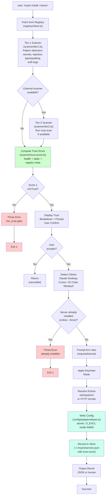
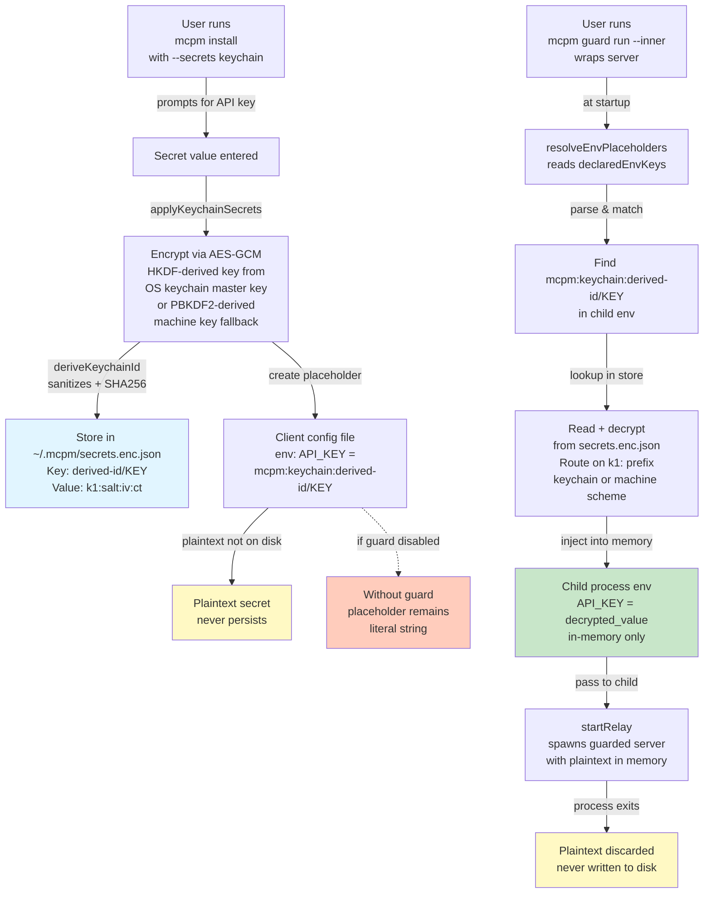
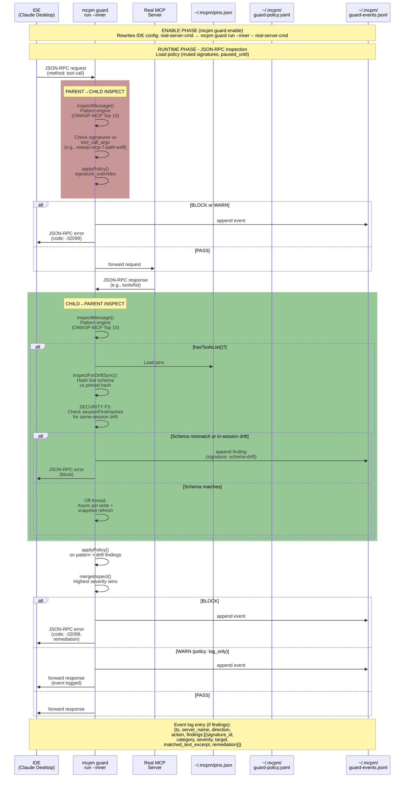

# mcpm — Architecture

## Project Structure

```
mcpm/
├── src/
│   ├── index.ts                    — CLI entry point (Commander)
│   ├── commands/
│   │   ├── index.ts                — command registration
│   │   ├── search.ts               — search the MCP registry
│   │   ├── install.ts              — install a server to client configs
│   │   ├── info.ts                 — show server details
│   │   ├── list.ts                 — list installed servers
│   │   ├── remove.ts               — remove a server from configs
│   │   ├── audit.ts                — trust-scan installed servers
│   │   ├── update.ts               — update installed servers
│   │   ├── doctor.ts               — check MCP setup health
│   │   ├── init.ts                 — install a curated starter pack
│   │   ├── import.ts               — import servers from client config
│   │   ├── serve.ts                — start mcpm as an MCP server
│   │   ├── disable.ts              — disable a server (thin wrapper over toggle)
│   │   ├── enable.ts               — re-enable a disabled server
│   │   ├── toggle.ts               — shared disable/enable logic
│   │   ├── completions.ts          — shell completion scripts (bash/zsh/fish)
│   │   ├── alias.ts                — short aliases for server names
│   │   ├── export.ts               — export installed servers as mcpm.yaml
│   │   ├── lock.ts                 — resolve versions + trust → mcpm-lock.yaml
│   │   ├── up.ts                   — batch install from mcpm.yaml with trust policy
│   │   └── diff.ts                 — compare installed vs declared state
│   ├── server/
│   │   ├── index.ts                — MCP server setup (registerTool, stdio transport)
│   │   ├── tools.ts                — Zod input schemas for each tool
│   │   └── handlers.ts             — tool handlers (wraps existing CLI logic)
│   ├── registry/
│   │   ├── client.ts               — RegistryClient (HTTP, injectable fetch)
│   │   ├── schemas.ts              — Zod schemas for API responses
│   │   ├── types.ts                — inferred TypeScript types
│   │   ├── pagination.ts           — async cursor-based pagination
│   │   └── errors.ts               — RegistryError, NotFoundError, NetworkError
│   ├── config/
│   │   ├── paths.ts                — OS-aware config file paths
│   │   ├── detector.ts             — detect installed AI clients
│   │   └── adapters/
│   │       ├── base.ts             — shared adapter logic
│   │       ├── claude-desktop.ts
│   │       ├── cursor.ts
│   │       ├── vscode.ts
│   │       ├── windsurf.ts
│   │       └── factory.ts          — adapter factory by client ID
│   ├── scanner/
│   │   ├── trust-score.ts          — 0-100 composite trust score
│   │   ├── tier1.ts                — metadata-based checks (registry meta)
│   │   ├── tier2.ts                — static pattern scanning
│   │   └── patterns.ts             — regex patterns for secrets, injection, typosquatting
│   ├── store/
│   │   ├── index.ts                — local state manager (~/.mcpm/)
│   │   ├── servers.ts              — installed server registry
│   │   ├── cache.ts                — HTTP response cache
│   │   └── aliases.ts              — server name aliases (~/.mcpm/aliases.json)
│   ├── stack/
│   │   ├── schema.ts               — Zod schemas for mcpm.yaml + mcpm-lock.yaml
│   │   ├── resolve.ts              — semver range resolution
│   │   ├── policy.ts               — trust policy enforcement
│   │   ├── env.ts                  — .env file parser
│   │   └── index.ts                — public API surface
│   ├── guard/                       — v0.5.0 runtime defense (mcpm-guard)
│   │   ├── types.ts                — Severity, Signature, InspectResult types
│   │   ├── patterns.ts             — pattern engine (NFKC + leaf walk + regex)
│   │   ├── signatures.ts           — vendored OWASP MCP Top 10 catalog
│   │   ├── relay.ts                — production stdio MITM (subprocess + in-process variants)
│   │   ├── wrap.ts                 — entry transformation (wrapEntry/unwrapEntry/isWrapped)
│   │   ├── orchestrator.ts         — two-phase commit across detected clients
│   │   ├── pins.ts                 — schema-pin storage + integrity sidecar
│   │   ├── drift.ts                — async drift detection + accept-drift application
│   │   ├── policy.ts               — guard-policy.yaml (mute/pause overrides)
│   │   ├── run-inner.ts            — `mcpm guard run --inner` entry, wires the relay
│   │   ├── event-log.ts            — append-only JSONL writer for guard-events.jsonl
│   │   ├── sanitize.ts             — shared ANSI/control-char terminal sanitizer
│   │   ├── store-integrity.ts      — shared fileSha / assertNotSymlink / writeFileAtomic (pins + policy + confine)
│   │   ├── cli.ts                  — Commander glue for enable/disable/status/cleanup
│   │   ├── confine/                 — OS confinement (F1, macOS-only, opt-in via --confine)
│   │   │   ├── profile.ts          — standard-tier read/write/net rule set
│   │   │   ├── derive.ts           — render a Seatbelt profile for a server (+ content hash)
│   │   │   ├── backend-macos.ts    — sandbox-exec backend + availability pre-check
│   │   │   ├── apply.ts            — wrap the child spawn argv with the backend
│   │   │   ├── store.ts            — ~/.mcpm/guard-confine.yaml enrollment store (+ integrity)
│   │   │   └── decide.ts           — spawn-time confine/fail-closed/hybrid-warn decision
│   │   └── demo/                   — synthetic echo-bot + runner for `mcpm guard demo`
│   └── utils/
│       ├── output.ts               — leveled output helpers
│       ├── confirm.ts              — confirmation prompts
│       ├── format-entry.ts         — format MCP server config entries
│       ├── format-trust.ts         — format trust score display
│       └── fs.ts                   — shared filesystem helpers (isEnoent)
├── src/__tests__/
│   ├── commands/                    — 16 command test files
│   ├── config/                      — adapter + detector + paths tests
│   └── store/                       — cache + servers + store tests
├── scripts/
│   └── demo.sh                     — asciinema demo recording script
├── .github/workflows/
│   ├── ci.yml                      — build + test on push/PR (Node 20, 22, 24)
│   └── publish.yml                 — npm publish + GitHub Release on v* tags (Node 24)
├── package.json                    — @getmcpm/cli, bin: mcpm
├── tsconfig.json
├── tsup.config.ts                  — bundler config
└── vitest.config.ts                — test config with coverage thresholds
```

## Modules

| Module | Purpose |
|---|---|
| `commands/` | 24 CLI commands (incl. `guard` subcommand group with 13 subcommands and `publish` with 3 subcommands), each a self-contained Commander action |
| `server/` | MCP server (stdio): 9 tools wrapping CLI logic via injectable handlers |
| `stack/` | Stack file schemas (mcpm.yaml/mcpm-lock.yaml), semver resolution, trust policy, .env parsing |
| `guard/` | **v0.5.0 runtime defense.** Stdio MITM relay, OWASP MCP Top 10 pattern engine, schema pinning + drift detection, policy file editor, integrity sidecars, event log. Plus `guard/confine/` (F1, unreleased/next minor): the first **enforcement** primitive — the relay optionally wraps the child spawn in an OS sandbox (macOS `sandbox-exec`) so a server physically can't read secret files or persist, complementing byte-level detection. See `docs/GUARD.md`. |
| `registry/` | Typed HTTP client for the official MCP Registry API (v0.1 at registry.modelcontextprotocol.io) |
| `config/` | OS-aware config paths, client detection, and per-client config adapters with atomic writes |
| `scanner/` | Trust scoring engine: tier 1 (metadata), tier 2 (static pattern analysis), composite score |
| `store/` | Local state in `~/.mcpm/` — installed server registry, HTTP response cache, server name aliases, guard pins + policy + events |
| `utils/` | Output formatting, confirmation prompts, trust display helpers |

## Commands

| Command | Description |
|---|---|
| `mcpm search <query>` | Search the MCP registry for servers |
| `mcpm install <name>` | Install an MCP server to detected client configs |
| `mcpm info <name>` | Show full details for an MCP server |
| `mcpm list` | List all installed servers across detected AI clients |
| `mcpm remove <name>` | Remove a server from client config(s) |
| `mcpm audit` | Scan all installed servers and produce a trust report |
| `mcpm update` | Check for newer versions and update installed servers |
| `mcpm outdated` | Show version drift and trust regression for installed servers |
| `mcpm doctor` | Check MCP setup health (runtimes, configs, servers) |
| `mcpm init <pack>` | Install a curated starter pack of MCP servers |
| `mcpm disable <name>` | Disable a server without removing it from config |
| `mcpm enable <name>` | Re-enable a previously disabled server |
| `mcpm import` | Import existing servers from client config files |
| `mcpm alias` | Create short aliases for long server names |
| `mcpm export` | Export installed servers as an mcpm.yaml stack file |
| `mcpm lock` | Resolve versions and create mcpm-lock.yaml with trust snapshots |
| `mcpm up` | Install all servers from mcpm.yaml with trust verification |
| `mcpm diff` | Compare installed servers against mcpm.yaml and lock file |
| `mcpm completions <shell>` | Generate shell completion scripts (bash, zsh, fish) |
| `mcpm serve` | Start mcpm as an MCP server (stdio transport) |
| `mcpm why <name>` | Explain a server's trust score (breakdown of all scoring components) |
| `mcpm secrets` | Manage encrypted credentials for MCP servers |
| `mcpm publish` | Publish an MCP server to the official registry |
| `mcpm guard enable / disable / status` | Wrap detected client configs with the inspection relay; restore; report state |
| `mcpm guard enable --confine` | Opt-in: also enroll unwrapped stdio servers into an OS sandbox (macOS-only; `--confine off` disables) |
| `mcpm guard doctor-confine` | Read-only: report OS-backend availability + enrolled servers (tier / net / require_confine) |
| `mcpm guard demo` | Synthetic prompt-injection scenario (visible block in terminal) |
| `mcpm guard accept-drift / mute / unmute / pause / cleanup` | Runtime tuning + escape hatches |
| `mcpm guard list-signatures / reset-integrity` | Catalog inspection + integrity sidecar regeneration |
| `mcpm guard run --inner` | Internal: relay entry point invoked by wrapped configs (semver-exempt) |

## Data Flow



### Secrets resolution data flow (`--secrets keychain`)

Plaintext secrets exist only in the guarded child's in-memory env — never on disk. Resolution is a property of **guarded** servers only.



### Guard data flow (v0.5.0 — when `mcpm guard enable` is active)



### OS confinement (F1 — unreleased / next minor)

Everything above is **detection**: the relay reasons about JSON-RPC bytes and warns
or blocks. It cannot *contain* the child it spawns — a server that decides to read
`~/.ssh` or write `~/Library/LaunchAgents` never expresses that intent through
inspectable traffic. `--confine` is the first **enforcement** primitive: it wraps the
relayed child in an OS sandbox so it physically cannot read secret files or persist,
regardless of the JSON-RPC it emits. Detection (watch) and confinement (contain) are
complementary. **macOS-only in v1** (Linux `bwrap` deferred); **opt-in** — without
`--confine`, enable/disable behavior is unchanged.

```
  mcpm guard enable --confine
       │  enrolls each UNWRAPPED stdio server it wraps
       ▼
  ~/.mcpm/guard-confine.yaml (+ .integrity)   ← source of truth for "server X is confined"
       │
       │  wrap marker gains two neutral tokens before `--`:
       │  --confine-profile-hash <sha256>  (binds marker ↔ stored profile)
       │  --confine-required               (bare flag, replicated into IDE config)
       ▼
  mcpm guard run --inner  (spawn-time decision, src/guard/confine/decide.ts)
       │
       ├── CONFINE  — enrolled + hash matches + backend available
       │     └─ apply.ts wraps the child argv with backend-macos.ts (sandbox-exec)
       │        using the derived Seatbelt profile (derive.ts + profile.ts)
       │
       ├── FAIL CLOSED (refuse to start, exit 1) — hash mismatch / malformed hash /
       │     stripped marker or wiped store on a require_confine server
       │
       └── HYBRID (WARN loudly + run UNCONFINED, never silent) — no OS backend
             (Linux/CI/Windows) or missing marker/profile on a NON-required server
```

Standard tier (macOS Seatbelt): **read** allow-all *except* a secret-dir denylist
(`~/.ssh`, `~/.aws`, `~/.gnupg`, cloud/gh/npm/docker/kube creds, keychains, browser
cookie stores, MCP client config dirs, and mcpm's own `~/.mcpm`); **write** deny all of
`$HOME` *except* caches, the per-server scratch dir, and system temp/`/dev` — one rule
that blocks the whole persistence class (`~/.zshrc`, LaunchAgents, PATH-shadowing
`~/bin`, git hooks); **net** launcher-classified (npx/uvx/pip/docker/… ⇒ network "all",
everything else ⇒ egress-deny). The confine store reuses the shared
`store-integrity.ts` extracted from `pins.ts` + `policy.ts` and fails closed on
integrity/shape/format-version mismatch. CONFINE events (`confine-applied`,
`confine-hash-mismatch`, `confine-marker-stripped`, …) append to
`guard-events.jsonl`; the OWASP signature catalog count is unchanged.

Honest caveats: the sandbox-exec path is not exercised in ubuntu-only CI (mocked
arg-vector unit tests + local darwin verification, same gap the os-keychain shell-outs
carry); net is launcher-permissive (do not read this as general exfil prevention); it
does not defend against a same-user attacker who can rewrite **both** the IDE config
and `~/.mcpm`. A strict tier (read-allowlist / scratch-only-write / host-granular net),
Linux `bwrap`, and the per-server `guard confine <server>` command are deferred (per-server
confine is achievable today via `enable --confine --server X` + `disable --server X`).

## Configuration

### Local state directory

```
~/.mcpm/
├── servers.json                  — installed server registry (name, version, clients, install date)
├── aliases.json                  — short aliases for server names
├── cache/                        — HTTP response cache (TTL-based)
├── pins.json                     — guard schema pins (v0.5.0)
├── pins.json.integrity           — sha256 sidecar over pins.json
├── guard-policy.yaml             — user overrides (mute/pause)
├── guard-policy.yaml.integrity   — sha256 sidecar over guard-policy.yaml
├── guard-confine.yaml            — confine enrollment store (F1; source of truth for "server X is confined")
├── guard-confine.yaml.integrity  — sha256 sidecar over guard-confine.yaml (fails closed on mismatch)
├── sandbox/<server>/             — per-server confine scratch dir (read+write inside the sandbox)
└── guard-events.jsonl            — append-only event log (parse with jq)
```

Plus, when `mcpm guard enable` runs, each touched client config gets a
`<config>.guard-{enable,disable}.bak` pre-batch backup alongside the per-write
`.bak` that `BaseAdapter.writeAtomic` already produces.

### Client config paths (macOS)

| Client | Config path |
|---|---|
| Claude Desktop | `~/Library/Application Support/Claude/claude_desktop_config.json` |
| Cursor | `~/.cursor/mcp.json` |
| VS Code | `~/Library/Application Support/Code/User/mcp.json` |
| Windsurf | `~/.codeium/windsurf/mcp_config.json` |

Linux and Windows paths are also supported. Config key: `mcpServers` (Claude Desktop, Claude Code, Cursor, Windsurf) or `servers` (VS Code).

All config writes use atomic file operations (write to `.tmp`, then `fs.rename`). Files are written with `mode: 0o600` and directories with `mode: 0o700` to restrict access.

## Testing

- **Framework**: vitest with `@vitest/coverage-v8`
- **Test count**: 812+ tests
- **Coverage thresholds**: lines 80%, branches 75%
- **Test locations**: `src/__tests__/` (command, config, store tests) + colocated `*.test.ts` (registry, scanner)
- **Approach**: injectable `fetchImpl` for registry tests (no network calls), temp directories for config adapter tests

Run tests:

```bash
pnpm test              # run all tests
pnpm test:coverage     # run with coverage report
pnpm test:watch        # watch mode
```

## CI/CD

### CI (`ci.yml`)

Runs on push to `main` and pull requests. Matrix: Node 22, 24, 26. All GitHub Actions are SHA-pinned.

Steps: `pnpm install --frozen-lockfile` → `typecheck` → `build` → `test:coverage`

### Publish (`publish.yml`)

Runs on `v*` tag push. Builds, tests, and publishes to npm as `@getmcpm/cli` with provenance.

