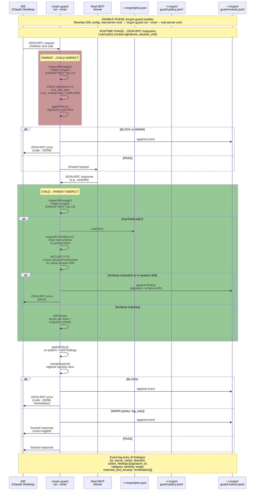

# mcpm-guard — Runtime defense reference (v0.5.0)

Long-form reference for `mcpm guard`. For the 5-minute getting-started path, see the README's "Runtime defense" section.

---

## Mental model

A wrapped MCP server's stdio looks like this:

```
   IDE (Claude Desktop / Cursor / ...)
            │  JSON-RPC over stdio
            ▼
   ┌──────────────────────────┐
   │ mcpm guard run --inner   │  ← the relay (spawned by the wrapped config)
   │  • inspect parent → child │
   │  • inspect child → parent │
   │  • compare against pins   │
   │  • block, warn, or pass   │
   └────────────┬─────────────┘
                │  spawned child process
                ▼
   the real MCP server (e.g. servers-filesystem)
```

`mcpm guard enable` rewrites your detected client configs (Claude Desktop / Cursor / VS Code / Windsurf) so each server's `command` becomes the relay, with the original command/args sandwiched after a `--` separator. `mcpm guard disable` restores the original entries.

Detection is layered:

| Layer | Triggered by | Scope |
|---|---|---|
| **Pattern engine** | Every message | NFKC-normalized regex against tool descriptions / responses / arguments / annotations |
| **Schema pinning** | `tools/list` responses | SHA-256 hash of {description, schema, annotations} vs the pin captured at install |
| **Same-session drift** | 2nd+ `tools/list` in one session | Catches mid-session rug-pull attempts before the pin write commits |
| **Policy overrides** | Every message | `~/.mcpm/guard-policy.yaml` overrides (mute / warn / block / log_only / paused) |

### Full message flow

The relay inspects each direction independently — a request (parent → child) and the matching response (child → parent) each run the full pattern + pin + policy pipeline before anything is forwarded:



---

## All commands

### `mcpm guard`
Bare invocation. Shows status if any servers are wrapped, otherwise prints help.

### `mcpm guard enable [--client <id>] [--server <name>] [--dry-run]`
Wraps detected client configs. Use `--client` to scope to one (`claude-desktop` / `cursor` / `vscode` / `windsurf`); `--server` to scope to a single server name. `--dry-run` prints the planned changes without writing.

The wrap transformation in JSON:
```
{ "command": "<orig>", "args": [...], "env": {...} }
  ↓
{ "command": "node", "args": ["<abs path to mcpm>/dist/index.js", "guard", "run", "--inner", "--server-name", "<name>", "--", "<orig>", ...], "env": {...} }
```

A pre-batch `.bak` snapshot is written per touched client (`<config>.guard-enable.bak`) so the whole operation is recoverable even if a single per-server write fails mid-batch.

### `mcpm guard disable [--client <id>] [--server <name>]`
Reverses the wrap by parsing the wrap marker out of the args and reconstructing the original entry. Falls back to the `.bak` if the wrap pattern is malformed (e.g. user hand-edited the config since enable).

### `mcpm guard status`
Prints what's wrapped and the pin state per server (unprotected / first-session-pin pending / fully protected).

### `mcpm guard demo`
Runs the in-process `prompt-injection` scenario. The output is byte-identical to what the production relay emits, so screenshotting the demo accurately represents what a real block looks like. Additional scenarios (`path-exfil`, `rug-pull`) ship in v0.5.0.1.

### `mcpm guard accept-drift <server> [--tool <name>] [--new-hash <sha256:...>] [--remove] [--yes]`

Re-pin a tool's schema after a legitimate upgrade. **Requires `--yes` (no prompt today)**, and one of:

- **`--new-hash sha256:...`** — copy the exact hash from the block-message remediation field. Required by default (no implicit "accept whatever comes next" window).
- **`--remove`** — drop the pin entirely.

`--tool` scopes to one tool; otherwise applies to all tools on that server.

### `mcpm guard mute <signature-id> [--for <duration>]`
Adds an `ignore` override to `~/.mcpm/guard-policy.yaml`. `--for 5m` / `1h` / `24h` / `7d` auto-expires.

The signature id must exist in the shipped set — typos are rejected with a list of valid ids (see `mcpm guard list-signatures`).

### `mcpm guard unmute <signature-id>`
Removes the override.

### `mcpm guard pause [--for <duration>] [--off]`
Pauses ALL guard inspection for a window (default 10 min). The relay continues forwarding traffic but skips inspection. `--off` lifts an active pause.

Use during debugging when guard is in the way and you want to turn it off without unwrapping configs.

### `mcpm guard cleanup [--yes]`
Prunes pin entries for servers no longer installed in any client config. Dry-run by default; pass `--yes` to apply.

### `mcpm guard list-signatures [--json]`
Shows the vendored OWASP MCP Top 10 signature catalog with id / category / severity / target / description.

### `mcpm guard reset-integrity [--policy] [--yes]`
Regenerates the integrity sidecar after manually editing `~/.mcpm/pins.json` (default) or `~/.mcpm/guard-policy.yaml` (`--policy`).

Required when:
- You copy `pins.json` between machines
- You hand-edit `guard-policy.yaml` directly (rather than via `mcpm guard mute/unmute/pause`)

The relay refuses to use either file if its sidecar doesn't match — this is the rug-pull defense for the configuration itself.

### `mcpm guard run --inner --server-name <name> -- <command> [args]`
**Internal command**, semver-exempt, not for direct user use. Invoked by wrapped client configs. Requires the `--inner` flag and refuses direct invocation without it.

---

## Files mcpm-guard touches

| Path | Purpose | Format |
|---|---|---|
| `~/.mcpm/pins.json` | Per-tool SHA-256 schema pins | JSON, see `docs/SIGNATURES.md` for the structure |
| `~/.mcpm/pins.json.integrity` | SHA-256 of `pins.json` content | One-line sha256 sidecar |
| `~/.mcpm/guard-policy.yaml` | User overrides + pause state | YAML, see `docs/POLICY.md` |
| `~/.mcpm/guard-policy.yaml.integrity` | SHA-256 of `guard-policy.yaml` | One-line sha256 sidecar |
| `~/.mcpm/guard-events.jsonl` | Append-only event log | JSON-Lines |
| `<client config>.guard-{enable,disable}.bak` | Pre-batch backup per touched client | Original JSON content |

All files are written `0o600`; the parent dir is `0o700`.

---

## Day-1 vs Day-7 vs Day-30 surface

- **Day 1:** `enable`, `disable`, `status`, `demo`. That's it.
- **Day 7:** `accept-drift` (you've hit your first legitimate server upgrade), `mute` (you've hit your first FP), `list-signatures` (you're curious what's protecting you).
- **Day 30:** `pause` (debugging), `cleanup` (you've uninstalled some servers), `reset-integrity` (you copied your `~/.mcpm/` between machines).

---

## When guard breaks your workflow

If a wrapped server stops working after `enable`, the order of escalation:

1. **`mcpm guard status`** — is the server in `unprotected (first-session-pin pending)` mode? That's fine; the next session captures the pin.
2. **`~/.mcpm/guard-events.jsonl`** — is there a block entry for that server? The `remediation` field tells you the exact command to run.
3. **`mcpm guard mute <id> --for 5m`** — temporary mute while you investigate.
4. **`mcpm guard pause --for 10m`** — turns off all inspection for 10 minutes.
5. **`mcpm guard disable --server <name>`** — permanently unwraps just that one server while keeping others protected.

If guard itself crashes (e.g. on PATH disruption — the wrapped command points at `mcpm`):
- All wrapped servers go dark simultaneously across all IDEs.
- Restore from `<client config>.guard-enable.bak` manually, or re-install `@getmcpm/cli` to restore the binary.

---

## Threat model (what guard does and doesn't protect against)

**Protects:**
- Prompt-injection text in tool responses (e.g. Slack messages, web fetches) — OWASP MCP-2
- Tool-description poisoning (Invariant Labs disclosure) — OWASP MCP-1
- Rug-pull schema mutation after install — OWASP MCP-1 via pinning
- Same-session double-`tools/list` poisoning — via per-session hash cache

**Does NOT protect against:**
- Compromised install — the wrap is opt-in via `mcpm guard enable`; if your machine is already compromised, the attacker can disable guard
- Same-user file tampering — `~/.mcpm/pins.json` and `~/.mcpm/guard-policy.yaml` have integrity sidecars, but a same-user attacker can compute new sidecars; the sidecars are an "accidental tamper / cross-user" defense, not anti-malware
- Verbatim attack-phrase documentation — the regex engine cannot distinguish "ignore previous instructions" used as documentation from the same phrase used as an instruction. The LLM-as-judge tier in v0.5.1+ would close this gap
- HTTP-transport servers — v0.5.0 wraps stdio only. HTTP guard is v0.5.1+

**Performance budget:** spike measured 0.065ms p99 small / 3.1ms p99 large message overhead through the SDK framing helpers (OQ1 closed). With NFKC + 15 regexes per leaf added on top, expected p99 is < 10ms for large messages.
